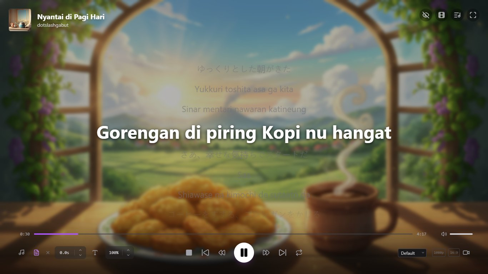
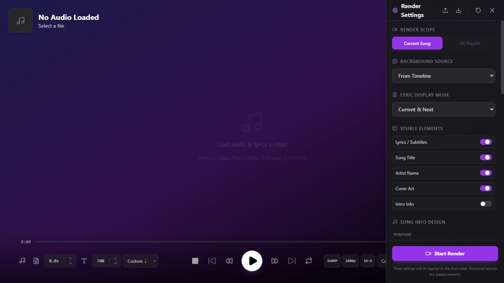

<div align="center">
  
  <h1>Immersive Audio Player & Lyric Video Maker</h1>
</div>

**Immersive Audio Player & Lyric Video Maker** is a powerful all-in-one web tool designed for music lovers and content creators. It combines a distraction-free audio player with a professional-grade timeline editor, allowing you to create stunning, synchronized lyric videos directly in your browser. Whether you want to enjoy your local music library with beautiful visuals or create viral content for TikTok, Instagram, and YouTube, this app delivers high-quality results without watermarks or server uploads.



## Key Features

### 🎧 Advanced Audio Player & Playlist
- **Smart Playlist**: Drag & drop multiple files. Automatically groups audio files with matching lyric files (`.lrc` or `.srt`) based on filename.
- **Interactive Lyric Timeline**: Each playlist item shows a mini-timeline of lyrics. Click any line to play that specific track starting from that time.
- **Sorting & Management**: Sort by Filename, Artist, Title, Album (Ascending/Descending), or Shuffle.
- **Repeat Modes**: Cycle between **Off**, **Repeat All**, and **Repeat One**.
- **Immersive Mode**: UI controls automatically fade out when idle for a distraction-free experience.


### 📝 Synchronized Lyrics
- **Dual Format Support**: Compatible with both `.lrc` (Karaoke style) and `.srt` (Subtitle style) files.
- **Auto-Scroll & Centering**: Lyrics scroll automatically and active lines are perfectly centered.
- **Lyric Offset Control**: Fine-tune sync issues with **+0.1s / -0.1s** buttons directly in the player.
- **Click-to-Seek**: Click any lyric line to instantly jump to that exact time.
- **Adjustable Font Size**: Use **+** / **-** hotkeys to adjust lyric size on the fly.
- **Visual Presets**: Choose from a wide variety of display styles:
  - **Standard**: Default, Big Text, Big Text (UP), Big Center (UP).
  - **Thematic**: Metal, Kids, Sad, Romantic, Tech, Gothic, Classic Serif, Monospace.
  - **Social**: 
    - **One Line / One Line (UP)**: Minimalist single-line display (Modern TikTok/Reels style).
    - **Slideshow**: Minimalist line-by-line.
    - **Subtitle**: Cinematic bottom-centered text (No song metadata).
    - **Just Video**: Hides text content.
    - **None**: Hides everything (Lyrics, Titles, and Metadata).
  - **Text Animations**: Bounce, Pulse, Wave, Glitch, Shake, and Typewriter effects.
  - **Display Modes**: Control lyric visibility (Show All, Previous-Active-Next, Next Only, Active Only).

### 🎬 Professional Visual Timeline Editor
 Create complex visual stories synchronized to your music.
- **Full Editing Suite**:
  - **Undo/Redo** (Ctrl+Z / Ctrl+Y): Never worry about mistakes.
  - **Copy/Cut/Paste** (Ctrl+C / Ctrl+X / Ctrl+V): Duplicate slides easily.
  - **Snapping**: Clips snap to each other, lyric timestamps, and grid lines for pixel-perfect timing.
- **Multi-Track Capabilities**: Add Images, Videos, and Sound Effects overlaid on the main track.
- **Advanced Selection**:
  - **Drag Selection**: Click and drag on the timeline background to interpretively select multiple clips.
  - **Shift + Click** for range selection.
  - **Ctrl + Click** for multi-selection.
- **Precise Control**:
  - **Arrow Keys**: Nudge selected clips by 0.1s.
  - **Volume Mixing**: Independent mute/volume control for every video and audio clip on the timeline.
- **Visual Effects**:
  - **Background Blur**: Toggle between 'Sharp' and 'Blur' for background media.


### 🎥 Content Creation & Export
- **Flexible Render Settings**:
  - **Resolution**: 720p / 1080p.
  - **Frame Rate**: Support for **24, 25, 30, 50, and 60 FPS**.
  - **Quality**: Adjustable bitrate presets (**Low, Med, High**).
  - **Visual Toggles**: Quick toggle for **Background Blur** with **Adjustable Blur Strength** directly in the export panel.
  - **Codecs**: Full control over output format, supporting **H.264 (MP4)**, **VP9 (WebM)**, and **AV1** (where supported).
- **Aspect Ratios**: 
  - **16:9** (Landscape - YouTube)
  - **9:16** (Vertical - TikTok/Reels)
  - **1:1** (Square - Instagram)
  - **4:5** (Portrait - Instagram Feed)
  - **3:4** (Portrait - Standard)
  - **4:3** (Landscape - Classic TV)
  - **2:3** (Portrait - Digital Photography)
  - **3:2** (Landscape - Classic Photo)
  - **2:1** (Landscape - Panoramic)
  - **20:9** (Landscape - Modern Mobile, Cinematic)
  - **21:9** (Landscape - Ultra Widescreen)
  - **1:2** (Vertical - Split Screen)
- **Rendering Scope**: Batch export the entire playlist or just the current song.
- **Advanced Backgrounds**:
  - **Timeline Media**: Use your custom images and videos from the timeline.
  - **Smart Gradient**: Generate beautiful gradients from a single color.
  - **Custom Gradient**: Manually define complex linear gradients.
  - **Solid Color**: Simple, clean backgrounds.
- **Lyric Display Control**:
  - **Modes**: Show All, Previous/Next, Next Only, or Active Line Only highlighting.
  - **Visibility**: Toggle Lyrics, Title, Artist, Cover Art, and Intro overlays independently.
  - **Intro Overlay**: 
    - **Modes**: Toggle 'Auto' (MetaData triggers on every song) or 'Manual' (Custom text triggers only on first playlist song).
- **Typography & Visual Effects**:
  - **Font Freedom**: Huge library of built-in fonts (Sans, Serif, Display, Handwriting, etc.) plus **Custom Font Upload**.
  - **Text Styling**: Controls for alignment, vertical position, size, and color.
  - **Effects Library**: 
    - **Text Effects**: Shadow, Glow, Neon, 3D Pop, Glitch, Retro, and more.
    - **Animations**: Pulse, Bounce, Wave, Shake, Typewriter, etc.
    - **Transitions**: Smooth Fade, Slide, Zoom, Flip, and Motion Blur.
- **Song Info Customization**:
  - **Positioning**: 9-point grid automatic positioning (Top-Left to Bottom-Right).
  - **Styles**: Classic (Detailed), Modern + Cover, Circle Cover, Boxed Cover, Minimal (Text Only).
  - **Padding**: Fine-tune margin from screen edges.
- **Smart Overlays**: Automatically generates metadata overlays for "Now Playing" visuals.
- **Dynamic Blur**: Apply real-time Gaussian-style blur to background images or videos for better lyric readability.
- **High-Fidelity Rendering**: Native **Canvas 2D** rendering allows for pixel-perfect text at any frame rate.




### 🛠 Technical Architecture
- **Rendering Engine**: Highly optimized **Canvas 2D** pipeline. Text rendering is handled natively by the browser, ensuring perfect clarity and compatibility with all languages and writing systems.
- **OffscreenCanvas Ready**: The application structure decouples rendering logic from the UI thread (`utils/canvasRenderer.ts`). This architecture supports `OffscreenCanvas` and Web Workers, enabling potential future upgrades for background rendering or "lag-free" exports on lower-end devices.
- **WebGPU Note**: While not currently used, the modular design allows for a hybrid approach in the future (e.g., using WebGPU for background visualizers while keeping Canvas 2D for crisp text overlays).

## Related Tools
Check out our other AI-powered tools for music and visuals:
- **[LyricFlow](https://ai.studio/apps/drive/1M1VfxdBlNB_eOPQqQiHspvVwizaEs0aI?showPreview=true&fullscreenApplet=true&showAssistant=true)**: Advanced lyric synchronization and flow.
- **[LyricalVision](https://aistudio.google.com/apps/drive/1WKA-bCxzIKD-DcI_pq0HznN3m1_oNEkg?fullscreenApplet=true&showPreview=true&showAssistant=true)**: AI-driven visual generation for your lyrics.

## Keyboard Shortcuts

| Key | Function |
| :--- | :--- |
| **N** | Play Next Song |
| **B** | Play Previous Song |
| **Space / K** | Play / Pause |
| **Arrow Left / Right** | Rewind / Forward 5s (Player) OR Nudge Slide (Editor) |
| **Arrow Up / Down**| Navigate Playlist Tracks (Playlist) OR Scroll Lyrics (Player) |
| **M** | Toggle Mute |
| **R** | Toggle Repeat Mode (Off -> All -> One) |
| **J** | Next Visual Preset |
| **+ / -**| Increase / Decrease Lyric Font Size |
| **S** | Stop & Reset |
| **H** | Toggle UI Auto-Hide Inhibit |
| **L** | Toggle Playlist View |
| **T** | Open/Close Timeline Editor |
| **D** | Toggle Render Settings Panel |
| **I** | Toggle Info Header |
| **P** | Toggle Player Controls |
| **F** | Toggle Fullscreen |
| **Delete** | Remove selected Playlist Item or Visual Slide |
| **Ctrl + Z / Y** | Undo / Redo (Editor) |
| **Ctrl + C / V** | Copy / Paste (Editor) |
| **Escape** | Abort Video Rendering |

| **Ctrl/Cmd + Shift + E** | Export / Render Video |

## Installation

This application is built with React + Vite and requires **Node.js** to run.

1.  **Prerequisites**: Install **Node.js** (LTS version recommended).
2.  **Install Dependencies**:
    ```bash
    npm install
    ```
3.  **Start the Server**:
    ```bash
    npm run dev
    ```
4.  **Launch**: Open `http://localhost:5173` in Chrome or Edge.

## How to Use

1. **Build a Playlist**: 
    - Click **"Add Audio & Lyrics"** in the Playlist panel.
    - Select multiple MP3s and LRCs at once. The app will pair them automatically.
2. **Design Visuals**: 
    - Press **T** to open the Timeline.
    - Drag & Drop media or use "Import Media".
    - Use **Ctrl+C / Ctrl+V** to duplicate sequences.
3. **Export Video**:
    - Choose your resolution and aspect ratio (e.g., **9:16** for TikTok).
    - Click the **Video Camera** icon.
    - Wait for the render to complete (Video plays in real-time).

---

## Panduan Pengguna (Bahasa Indonesia)

### Fitur Utama Baru
- **Playlist Pintar**: Masukkan banyak file sekaligus. Aplikasi otomatis memasangkan lagu dengan lirik (`.lrc`/`.srt`) yang bernama sama.
- **Timeline Lirik Interaktif**: Lihat cuplikan lirik di playlist. Klik baris mana saja untuk langsung memutar lagu itu.
- **Sorting Fleksibel**: Urutkan playlist berdasarkan Artis, Judul, Album (Bolak-balik Ascending/Descending), atau acak.
- **Kontrol Akurasi**: Atur offset lirik (maju/mundur 0.1s) jika teks kurang pas dengan suara.
- **Visual Efek**: Fitur **Background Blur** (dengan **Slider Kekuatan Blur**), **Smart Gradient**, dan **Text Animation** (Bounce, Pulse, Glitch, dll).
- **Kustomisasi Info Lagu**: Atur posisi, gaya tampilan, jarak tepi (padding), serta **Intro** teks (Auto/Manual).
- **Mode Tampilan Lirik**: Pilih mau tampilkan semua baris, atau hanya aktif/berikutnya saja.
- **Timeline Canggih**: Sekarang dengan fitur **Undo/Redo**, **Copy-Paste** slide, **Drag Selection**, dan **Snapping** otomatis agar visual pas dengan ketukan lirik.
- **Shortcut Baru**: Tekan **D** (Render Settings), **N**/**B** (Next/Prev), **M** (Mute), **R** (Repeat), **L** (Playlist), **+/-** (Font), dan **Ctrl/Cmd+Shift+E** (Export).

### Cara Install & Jalan
1.  Pastikan sudah install **Node.js**.
2.  Buka terminal di folder project:
    ```bash
    npm install
    npm run dev
    ```
3.  Buka browser di `http://localhost:5173`.

### Alur Kerja
1.  **Playlist**: Masukkan semua aset lagu dan lirik. Gunakan panah Atas/Bawah untuk ganti lagu.
2.  **Visual**:
    - Tekan **T** untuk menu Visual.
    - Masukkan gambar/video background.
    - Gunakan **Ctrl+Z** jika salah edit.
    - Shift+Klik untuk pilih banyak slide.
3.  **Export**:
    - Pilih rasio (termasuk 20:9 & 21:9), **FPS**, **Codec**, dan **Kualitas** (**Low, Med, High**) yang diinginkan.
    - Klik tombol Video 🎥.
    - Jangan ganti tab browser sampai selesai.
