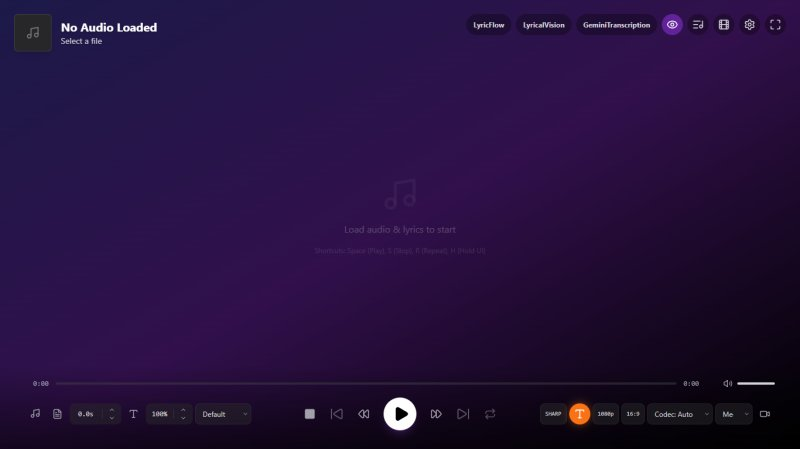
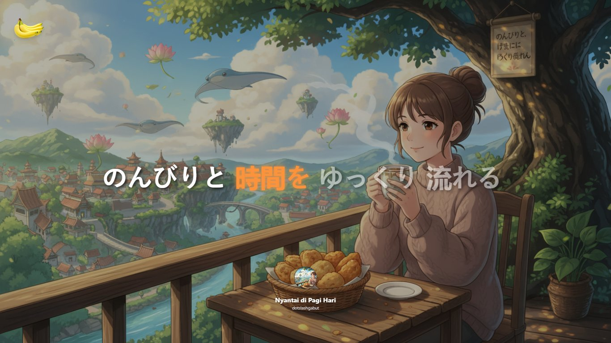
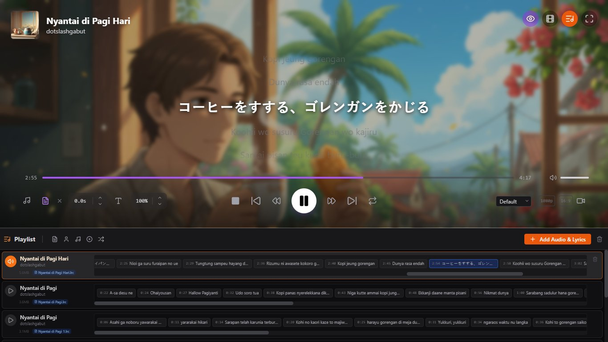
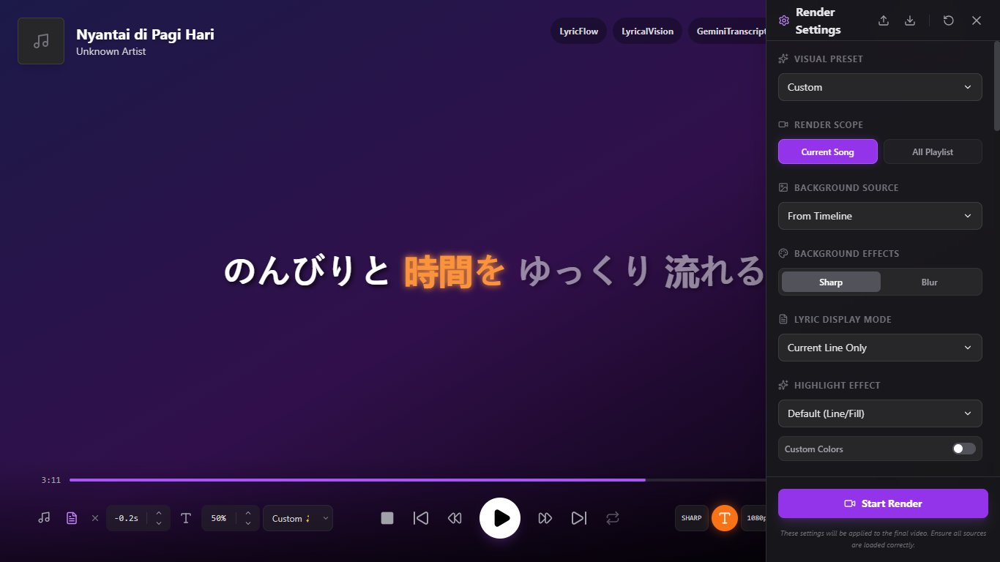
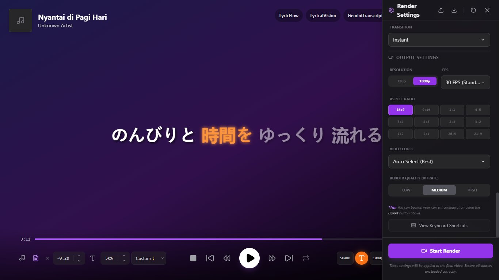
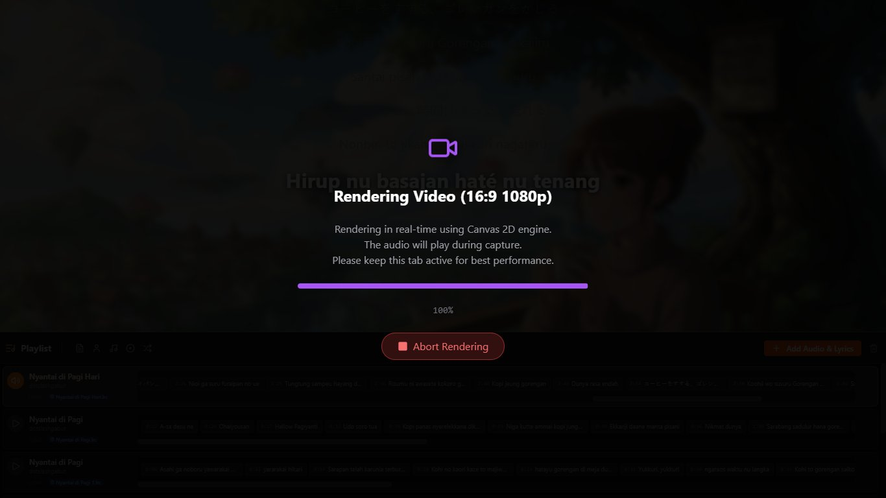

<div align="center">
  
  <h1>Immersive Audio Player & Lyric Video Maker</h1>
  <p><b>Version 2.3.0</b></p>
</div>

**Immersive Audio Player & Lyric Video Maker** is a powerful all-in-one web tool designed for music lovers and content creators. It combines a distraction-free audio player with a professional-grade timeline editor, allowing you to create stunning, synchronized lyric videos directly in your browser. Whether you want to enjoy your local music library with beautiful visuals or create viral content for TikTok, Instagram, and YouTube, this app delivers high-quality results without watermarks or server uploads.





## Key Features

### 🎧 Advanced Audio Player & Playlist
- **Smart Playlist**: Drag & drop multiple files. Automatically groups audio/video files with matching lyric files (`.lrc`, `.srt`, `.vtt`, `.ttml`, `.xml`) based on filename.
- **Interactive Lyric Timeline**: Each playlist item shows a mini-timeline of lyrics. Click any line to play that specific track starting from that time.
- **Sorting & Management**: Sort by Filename, Artist, Title, Album (Ascending/Descending), or Shuffle.
- **Repeat Modes**: Cycle between **Off**, **Repeat One**, **Play All** (Play playlist once), and **Repeat All** (Loop playlist).
- **Immersive Mode**: UI controls automatically fade out when idle for a distraction-free experience.
- **Smart Play/Pause**: Clicking the active track in the playlist toggles Play/Pause.
- **Auto-Load**: Automatically cues the first track for playback when adding new audio files.



### 📝 Synchronized Lyrics
- **Multi-Format Support**: Compatible with `.lrc` (Standard & Enhanced with **newline support**), `.srt` (Subtitle style), **`.vtt` (WebVTT with Word-Level timestamps)**, and **`.ttml` / `.xml`** (Word-level precision).
- **Auto-Scroll & Centering**: Lyrics scroll automatically and active lines are perfectly centered.
- **Lyric Offset Control**: Fine-tune sync issues with **+0.1s / -0.1s** buttons directly in the player.
- **Click-to-Seek & Copy**: Click any lyric line to instantly jump to that exact time. **Click the active line** to copy its text to the clipboard.
- **Adjustable Font Size**: Use **+** / **-** hotkeys to adjust lyric size on the fly.
- **Visual Presets**: Choose from a wide variety of display styles:
  - **Standard**: Default, Big Text, Big Text (UP), Big Center (UP).
  - **Thematic**: Metal, Kids, Sad, Romantic, Tech, Gothic, Classic Serif, Monospace.
  - **Social**: 
    - **One Line / One Line (UP)**: Minimalist single-line display (Modern TikTok/Reels style).
    - **Slideshow**: Minimalist line-by-line.
    - **Subtitle**: Cinematic bottom-centered text (No song metadata).
    - **Just Video**: Hides text content.
    - **None**: Hides everything (Lyrics, Titles, and Metadata).
  - **Karaoke Styles**: **Neon**, **Glow**, **Bounce**, **Wave**, and **Color/Shape** highlights (Pill, Box, Rounded) with **customizable colors**.
  - **Text Animations**: Bounce, Pulse, Wave, Glitch, Shake, Typewriter, Heartbeat, Tada, Jello, and more.
  - **Display Modes**: Control lyric visibility context and **Style Target** (Apply styles to Active Line only or All Lines).
- **AI Transcription**: Built-in integration with **Google Gemini** (supports **Gemini 2.5 Flash** and **3.0 Flash Preview**) for automatic high-accuracy audio transcription.
  - **Mixed-Language Support**: Expertly handles code-switching (e.g., K-Pop, J-Pop with English) and preserves native scripts (No forced transliteration).
- **Export Lyrics**: Save your transcribed or edited lyrics as `.lrc` (Standard or **Enhanced/Karaoke**), `.srt`, `.vtt` (Standard or **Karaoke**), `.json`, or `.txt` files.
- **Online Lyric Search**: Built-in search engine to find and download synchronized lyrics from **Musixmatch**, **LRCLIB**, and **Netease** with a single click.
- **Manual Management**: Manually load external `.lrc` / `.srt` files or clear existing lyrics for any track.

### 🎬 Professional Visual Timeline Editor
 Create complex visual stories synchronized to your music.
- **Multi-Track Layering**:
  - **2 Visual Tracks**: Layer videos and images (Background + Overlay).
  - **2 Audio Tracks**: Layer sound effects or secondary audio.
- **Full Editing Suite**:
  - **Undo/Redo** (Ctrl+Z / Ctrl+Y): Never worry about mistakes.
  - **Copy/Cut/Paste** (Ctrl+C / Ctrl+X / Ctrl+V): Duplicate slides easily.
  - **Snapping**: Clips snap to each other, lyric timestamps, grid lines, and playhead for pixel-perfect timing.
  - **Video Looping**: Automatically loops video clips when extended beyond their original duration.
- **Advanced Selection**:
  - **Drag Selection**: Click and drag on the timeline background to interpretively select multiple clips.
  - **Shift + Click** for range selection.
  - **Ctrl + Click** for multi-selection.
- **Precise Control**:
  - **Arrow Keys**: Nudge selected clips by 0.1s.
  - **Lyric Navigation**: Click any lyric block on the timeline to jump the player to that exact time.
  - **Volume Mixing**: Independent mute/volume control for every video and audio clip on the timeline.
  - **Playback Speed**: Precise manual control for playback rate (0.25x - 2.0x) on individual video and audio clips.
- **Visual Effects**:
  - **Background Blur**: Toggle between 'Sharp' and 'Blur' for background media.


### 🎥 Content Creation & Export
- **Flexible Render Settings**:
  - **Render Engine**: 
    - **Browser Recorder**: Fast, real-time capture.
    - **FFmpeg WASM**: Professional frame-by-frame rendering (No dropped frames).
  - **Resolution**: 720p / 1080p.
  - **Frame Rate**: Support for **24, 25, 30, 50, and 60 FPS**.
  - **Quality**: Adjustable bitrate presets (**Low, Med, High**).
  - **Visual Toggles**: Quick toggle for **Background Blur** with **Adjustable Blur Strength** directly in the export panel.
  - **Codecs**: Full control over output format, supporting **H.264 (MP4)**, **VP9 (WebM)**, and **AV1** (where supported).
- **Aspect Ratios**: 
  - **16:9** (Landscape - YouTube)
  - **9:16** (Vertical - TikTok/Reels)
  - **1:1** (Square - Instagram)
  - **4:5** (Portrait - Instagram Feed)
  - **3:4** (Portrait - Standard)
  - **4:3** (Landscape - Classic TV)
  - **2:3** (Portrait - Digital Photography)
  - **3:2** (Landscape - Classic Photo)
  - **2:1** (Landscape - Panoramic)
  - **20:9** (Landscape - Modern Mobile, Cinematic)
  - **21:9** (Landscape - Ultra Widescreen)
  - **1:2** (Vertical - Split Screen)
- **Rendering Scope**: Batch export the entire playlist or just the current song.
- **Settings Management**:
  - **JSON Import/Export**: Backup, share, or restore your exact render configurations (visuals, fonts, layouts) with a single click.
- **Advanced Backgrounds**:
  - **Timeline Media**: Use your custom images and videos from the timeline.
  - **Custom Image**: Direct support for single custom background images.
  - **Smart Gradient**: Generate beautiful gradients from a single color.
  - **Custom Gradient**: Manually define complex linear gradients.
  - **Solid Color**: Simple, clean backgrounds.
  - **Gradient Overlay**: Optional bottom-up fade for better text readability.
  - **Real Color Media**: Toggle to disable the default dark dimming overlay, allowing background visual colors to pop.
- **Lyric Display Control**:
  - **Modes**: Show All, Previous/Next, Next Only, or Active Line Only highlighting.
  - **Visibility**: Toggle Lyrics, Title, Artist, Cover Art, and Intro overlays independently.
  - **Intro Overlay**: 
    - **Modes**: Toggle 'Auto' (MetaData triggers on every song) or 'Manual' (Custom text triggers only on first playlist song).
- **Typography & Visual Effects**:
  - **Font Freedom**: Huge library of built-in fonts (Sans, Serif, Display, Handwriting, etc.) plus **Custom Font Upload**.
  - **Text Styling**: Controls for alignment, vertical position, size, and color.
  - **Text Transformations**: **Uppercase**, **Lowercase**, **Title Case**, **Sentence Case**, and **Invert Case** overrides.
  - **Effects Library**: 
    - **Text Effects**: Shadow, Glow, Neon, 3D Pop, Glitch, Retro, and more.
    - **Animations**: Pulse, Bounce, Wave, Shake, Typewriter, Heartbeat, Flash, Spin, and more.
    - **Transitions**: Smooth Fade, Slide, Zoom, Flip, Motion Blur, Spiral, Shatter, and **None** (Instant Cut).
- **Song & Channel Info Customization**:
  - **Positioning**: 9-point grid automatic positioning (Top-Left to Bottom-Right).
  - **Song Styles**: Classic (Detailed), Modern + Cover, Circle Cover, Boxed Cover, Minimal (Text Only).
  - **Channel Styles**: Classic, Modern, Minimal, Logo Only (**SVG Support**), Boxed.
  - **Padding**: Fine-tune margin from screen edges for both **Song Info** and **Channel Info** (Visible in Minimal Mode).
- **Smart Overlays**: Automatically generates metadata overlays for "Now Playing" visuals.
- **Dynamic Blur**: Apply real-time Gaussian-style blur to background images or videos for better lyric readability.
- **High-Fidelity Rendering**: Native **Canvas 2D** rendering allows for pixel-perfect text at any frame rate.







### 🛠 Technical Architecture
- **Dual Rendering Engine**: 
  - **MediaRecorder (Real-time)**: Captures the canvas stream in real-time. Fast for simple exports.
  - **FFmpeg WASM (Offline/High-Quality)**: Client-side video encoding using FFmpeg compiled to WebAssembly. Supports frame-by-frame rendering for perfect synchronization and higher bitrates, regardless of computer speed.
  - **Smart Fallback**: Automatically switches between Multi-threaded (SharedArrayBuffer) and Single-threaded cores based on browser capabilities and server headers (COOP/COEP).
  - **Offline-First**: Intelligently loads FFmpeg cores from local cache (`/public/ffmpeg`) if available, falling back to CDN only when necessary.
- **Rendering Pipeline**: Highly optimized **Canvas 2D** pipeline. Text rendering is handled natively by the browser, ensuring perfect clarity. Advanced effects (Fire, VHS, etc.) are simulated in Canvas to match CSS visuals during export.
- **OffscreenCanvas Ready**: The application structure decouples rendering logic from the UI thread (`utils/canvasRenderer.ts`). This architecture supports `OffscreenCanvas` and Web Workers.
- **WebGPU Note**: While not currently used, the modular design allows for a hybrid approach in the future (e.g., using WebGPU for background visualizers while keeping Canvas 2D for crisp text overlays).

## Related Tools
Check out our other AI-powered tools for music and visuals:
- **[LyricFlow](https://ai.studio/apps/drive/1M1VfxdBlNB_eOPQqQiHspvVwizaEs0aI?fullscreenApplet=true)**: Advanced lyric synchronization and flow.
- **[LyricalVision](https://ai.studio/apps/drive/1WKA-bCxzIKD-DcI_pq0HzxN3m1_oNEkg?fullscreenApplet=true)**: AI-driven visual generation for your lyrics.
- **[GeminiTranscription](https://ai.studio/apps/drive/1IQUhhLIAJ_dYYbcOLni-x8LLk7Py4SSX?fullscreenApplet=true)**: AI-powered transcription for your audio files.

## Keyboard Shortcuts

| Key | Function |
| :--- | :--- |
| **N** | Play Next Song |
| **B** | Play Previous Song |
| **Space / K** | Play / Pause |
| **Arrow Left / Right** | Rewind / Forward 5s (Player) OR Nudge Slide (Editor) |
| **Arrow Up / Down**| Navigate Playlist Tracks (Playlist) OR Scroll Lyrics (Player) |
| **M** | Toggle Mute |
| **R** | Toggle Repeat Mode (Off -> All -> One) |
| **J** | Next Visual Preset |
| **+ / -**| Increase / Decrease Lyric Font Size |
| **S** | Stop & Reset |
| **X** | Split Clip at Playhead (Timeline Editor) |
| **H** | Toggle UI Auto-Hide Inhibit |
| **G** | Cycle Lyric Display Mode |
| **C** | Cycle Text Case |
| **L** | Toggle Playlist View |
| **T** | Open/Close Timeline Editor |
| **D** | Toggle Render Settings Panel |
| **I** | Toggle Info Header |
| **O** | Toggle Minimal Mode |
| **P** | Toggle Player Controls |
| **X** | Toggle Highlight Effect On/Off |
| **Z** | Cycle Next Highlight Effect |
| **F** | Toggle Fullscreen |
| **Delete** | Remove selected Playlist Item or Visual Slide |
| **Ctrl + Z / Y** | Undo / Redo (Editor) |
| **Ctrl + C / X / V** | Copy / Cut / Paste (Editor) |
| **Escape** | Abort Video Rendering / Close Modal |
| **Enter** | Confirm Dialog Action |

| **Ctrl/Cmd + Shift + E** | Export / Render Video |

## Installation

This application is built with React + Vite and requires **Node.js** to run.

1.  **Prerequisites**: Install **Node.js** (LTS version recommended).
2.  **Install Dependencies**:
    ```bash
    npm install
    ```
3.  **Start the Server**:
    ```bash
    npm run dev
    ```
4.  **Launch**: Open the URL shown in your terminal (usually `http://localhost:5173`) in Chrome or Edge.

## Configuration (Optional)

 To use the **AI Transcription** feature, you need a Google Gemini API Key.

 1.  Get a free API Key from [Google AI Studio](https://aistudio.google.com/app/apikey).
 2.  Create a file named `.env.local` in the root directory.
 3.  Add your API key:
     ```env
     GEMINI_API_KEY=your_api_key_here
     ```
     _Alternatively, you can enter the API Key directly in the application UI (Config Icon)._
 4.  **Restart Server**: If the server is running, restart it (`Ctrl+C` then `npm run dev`) to load the new environment variables.


## How to Use

1. **Build a Playlist**: 
    - Click **"Add Audio & Lyrics"** in the Playlist panel.
    - Select multiple MP3s and LRCs at once. The app will pair them automatically.
2. **Design Visuals**: 
    - Press **T** to open the Timeline.
    - Drag & Drop media or use "Import Media".
    - Use **Ctrl+C / Ctrl+V** to duplicate sequences.
3. **Export Video**:
    - Choose your resolution and aspect ratio (e.g., **9:16** for TikTok).
    - Click the **Video Camera** icon.
    - Wait for the render to complete (Video plays in real-time).

---

## Panduan Pengguna (Bahasa Indonesia)

### Fitur Utama Baru
- **Playlist Pintar**: Masukkan banyak file sekaligus. Aplikasi otomatis memasangkan lagu dengan lirik (`.lrc`/`.srt`) yang bernama sama.
- **Timeline Lirik Interaktif**: Lihat cuplikan lirik di playlist. Klik baris mana saja untuk langsung memutar lagu itu.
- **Sorting Fleksibel**: Urutkan playlist berdasarkan Artis, Judul, Album (Bolak-balik Ascending/Descending), atau acak.
- **Kontrol Akurasi**: Atur offset lirik (maju/mundur 0.1s) jika teks kurang pas dengan suara.
- **Formato Luas**: Dukungan untuk `.lrc`, `.srt`, **`.vtt` (termasuk Karaoke/Word-Level)**, dan **`.ttml` / `.xml`**.
- **Support Video**: Load file video (MP4, WebM) sebagai track audio + background otomatis.
- **Karaoke Kustom**: Pilihan efek highlight baru (**Neon, Glow, Box, Pill**) dengan **Pewarnaan Kustom** (Text & Background Color).
- **Visual Efek**: Fitur **Background Blur** (dengan **Slider Kekuatan Blur**), **Smart Gradient**, dan **Text Animation** (Bounce, Pulse, Glitch, dll).
- **Kustomisasi Info Lagu**: Atur posisi, gaya tampilan, jarak tepi (padding) untuk **Info Lagu & Channel**, serta **Intro** teks (Auto/Manual).
- **Mode Tampilan Lirik**: Pilih mau tampilkan semua baris, atau hanya aktif/berikutnya saja.
- **AI Transkripsi**: Dukungan model **Gemini 2.5 Flash** dan **3.0 Flash Preview** untuk transkripsi audio otomatis yang presisi.
- **Ekspor Lirik**: Simpan hasil transkripsi dalam format `.lrc`, `.srt`, `.vtt`, `.json`, atau `.txt`.
- **Timeline Canggih**: Dukungan **Multi-Layer** (2 Visual + 2 Audio), **Undo/Redo**, **Cut/Copy/Paste**, **Drag Selection**, dan **Snapping** otomatis.
- **Shortcut Baru**: Tekan **D** (Render Settings), **O** (Minimal Mode), **N**/**B** (Next/Prev), **M** (Mute), **R** (Repeat), **L** (Playlist), **+/-** (Font), dan **Ctrl/Cmd+Shift+E** (Export).

### Cara Install & Jalan
1.  Pastikan sudah install **Node.js**.
2.  Buka terminal di folder project:
    ```bash
    npm install
    npm run dev
    ```
3.  Buka browser di alamat yang muncul di terminal (biasanya `http://localhost:5173`).

### Alur Kerja
1.  **Playlist**: Masukkan semua aset lagu dan lirik. Gunakan panah Atas/Bawah untuk ganti lagu.
2.  **Visual**:
    - Tekan **T** untuk menu Visual.
    - Masukkan gambar/video background.
    - Gunakan **Ctrl+Z** jika salah edit.
    - Shift+Klik untuk pilih banyak slide.
3.  **Export**:
    - Pilih rasio (termasuk 20:9 & 21:9), **FPS**, **Codec**, dan **Kualitas** (**Low, Med, High**) yang diinginkan.
    - Klik tombol Video 🎥.
    - Jangan ganti tab browser sampai selesai.
